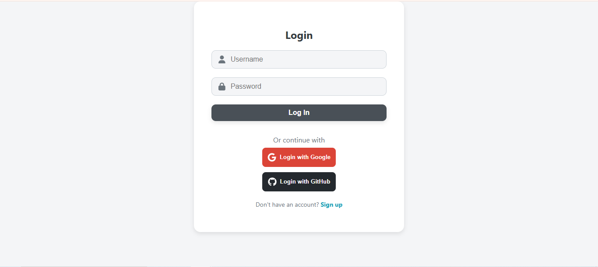
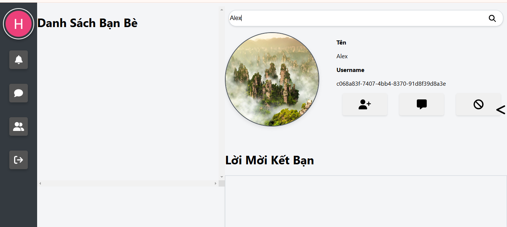
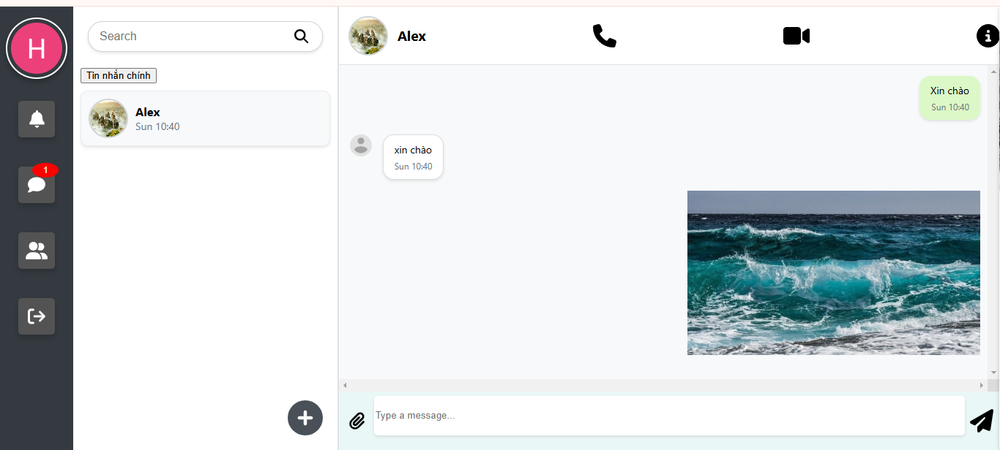
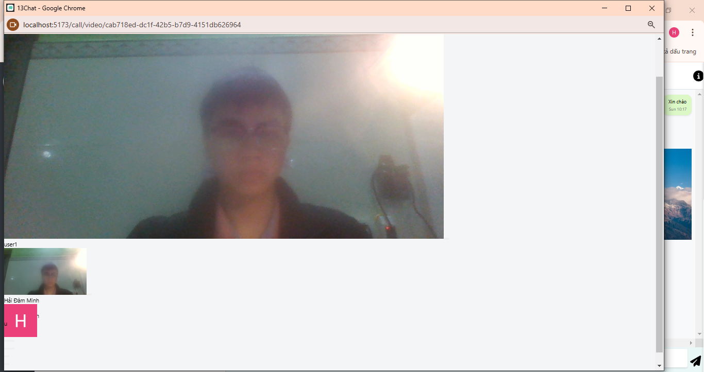

# 13Chat !

A messaging application with friend connection features, private messaging, 
group messaging, file sharing, image and video calls.

## Project overview

1. Login page
   Users can choose to sign up for an account or log in via Google or GitHub.
   

2. Search page
   Users can search for friends, manage their friend list, or block others if desired.
   

3. Messaging
   Users can send messages and files to their friends.
   

4. Video call
   The application also allows users to make video calls
   
